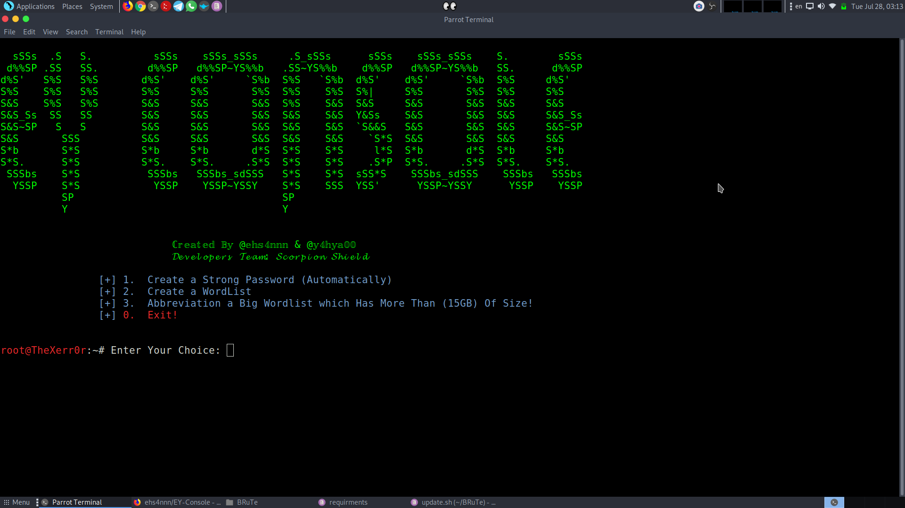

# EY-Console

[]

        The EY-CONSOLE Is a FrameWork, Created By Scorpion Shield Team

          What This Tool Is Goona Do?
                ▶️ Create a Strong Password With 2 Different Way!
                ▶️ Create a Wordlist With Defferent Tools!
                ▶️ Abbreviation a Big Wordlist which Has More Than (15GB) Of Size!
          This Tool Is Programmed By Python3 And Any Linux And Windows And MacOSX Users Can Install It  :)

          HOW TO INSTALL THE TOOL
                ▶️ sudo git clone https://github.com/ehs4nnn/EY-Console
                ▶️ cd EY-Console
                ▶️ sudo pip3 install -r requirements.txt
                ▶️ sudo chmod +x EY_CONSOLE.py
                ▶️ sudo python3 EY_CONSOLE.py
          HOW TO UPDATE IT
                ▶️ cd EY-Console
                ▶️ sudo chmod +x update.sh
                ▶️ sudo ./update.sh

                 
 If You Want To See Our Private Tools, Please Send Your Donates To Montivate Us Publish Our Private Tool :)
 BitCoin Address: 1NZtHATWTyzmb1PghFrvwDDmVUCfCLNQWm
